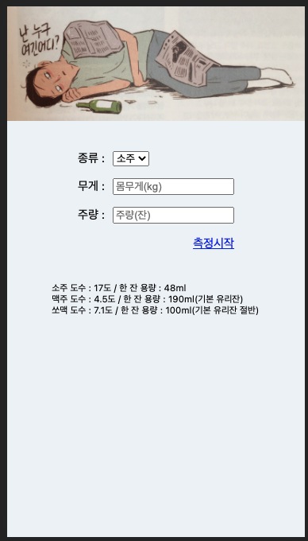
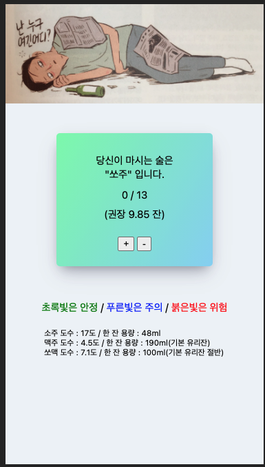
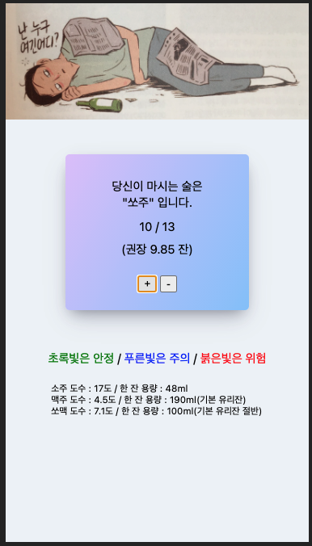
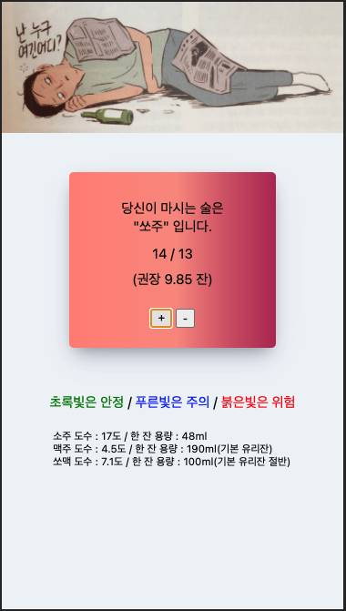

<!--
*** Thanks for checking out the Best-README-Template. If you have a suggestion
*** that would make this better, please fork the repo and create a pull request
*** or simply open an issue with the tag "enhancement".
*** Thanks again! Now go create something AMAZING! :D
-->

<!-- PROJECT SHIELDS -->
<!--
*** I'm using markdown "reference style" links for readability.
*** Reference links are enclosed in brackets [ ] instead of parentheses ( ).
*** See the bottom of this document for the declaration of the reference variables
*** for contributors-url, forks-url, etc. This is an optional, concise syntax you may use.
*** https://www.markdownguide.org/basic-syntax/#reference-style-links
-->
<!--
[![Contributors][contributors-shield]][contributors-url]
[![Stargazers][stars-shield]][stars-url]
[![Issues][issues-shield]][issues-url]
[![MIT License][license-shield]][license-url]
[![LinkedIn][linkedin-shield]][linkedin-url]-->

<!-- ABOUT THE PROJECT -->
## 프로젝트에 대해
 * 매번 술을 조절하지 못하는 사람들이 스스로 몇잔 먹었는지 카운트하고, 이를 바탕으로 경고해주는 SPA. 
 (리액트 기초를 공부하기 위해 만들어 보았다)

## 페이지 접속
 *  https://juicyorange.github.io/check_drunken/#/  
 (모바일 사용 권장. PC에서는 화면비율이 맞지 않을 수 있음 )

## 사용법
 1. 먹는 술을 정하고, 그에 따른 자신이 생각하는 주량, 자신의 체중을 입력한다.
 2. '+'와 '-' 버튼을 통해 마신 잔수를 계산한다.
 3. 마신 잔수에 따라 변하는 색을 확인하고, 집에 안전히 귀 가할 수 있도록 하자.

## 이미지
<!-- 사진 순서별로 정렬할 수 있도록. -->
  
  
  
  

